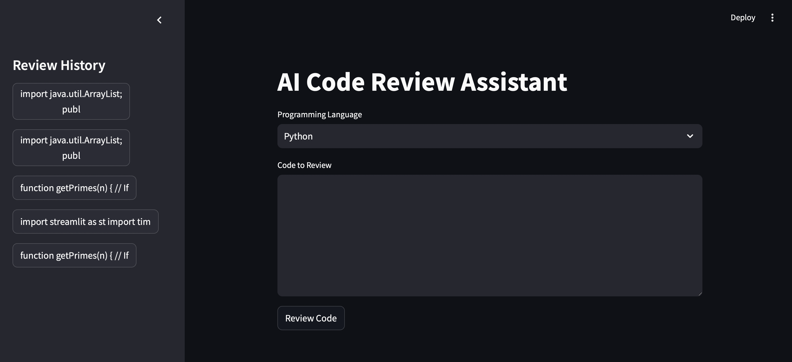

# 

# AI Code Reviewer  
An AI-powered code reviewer supporting multiple programming languages, including:  
**Python, JavaScript, Ruby, Java, SQL**  

The project leverages **LangChain**, **Ollama**, **Peewee**, and **Streamlit** for its core functionalities.

---

### **Project Structure**:
- **`ai.py`**: Handles AI functions.  
- **`database.py`**: Manages database interactions.  
- **`config`**: Stores configuration variables.  
- **`app.py`**: Implements the UI using Streamlit.  

---

### **Installation**:
Run the following command to install the required packages:  
```bash
pip install mlflow streamlit peewee langchain-community langchain langchain-ollama
